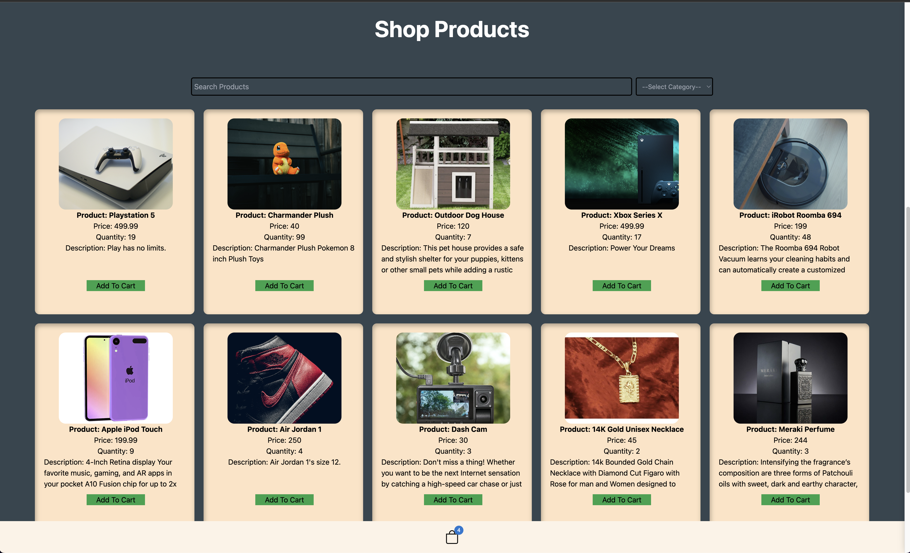
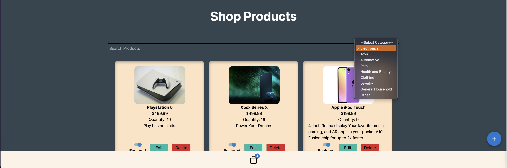

# The N-T Collection

This project is deployed on Vercel and can be accessed by here: https://the-n-t-collection.vercel.app/

The N-T Collection is an E-Commerce app built by [@NathanielGrandinette](https://www.github.com/NathanielGrandinette) and [@Tim-Quattrochi](https://github.com/Tim-Quattrochi). It contains a wide variety of products, including a shopping cart, checkout page, wishlist, edit user details, register, and login features, as well as admin privileges to add new products, edit Product Photo, Quanity, Description, Price, and delete.

The admin is also able to "Feature" a product and it will show up in the product carousel on the shop page that is dynamically linked to the product.

---





---

## Tech Stack

---

<p style="text-align: center;">Front-End</p>

---

- [React] - React is a free and open-source front-end JavaScript library for building user interfaces based on components. It is maintained by Meta and a community of individual developers and companies. React can be used to develop single-page, mobile, or server-rendered applications with frameworks like Next.js..

- [Tailwind CSS] - A utility-first CSS framework packed with classes like flex, pt-4, text-center and rotate-90 that can be composed to build any design, directly in your markup.

- [CSS] - Cascading Style Sheets (CSS) is a stylesheet language used to describe the presentation of a document written in HTML or XML (including XML dialects such as SVG, MathML or XHTML). CSS describes how elements should be rendered on screen, on paper, in speech, or on other media.

---

<p style="text-align: center;">Back-End</p>

---

- [Mongoose] - Mongoose is an object modeling tool for MongoDB and Node.js.

- [Node.js] - Cross-platform, open-source server environment that can run on Windows, Linux, Unix, macOS, and more. Node.js is a back-end JavaScript runtime environment, runs on the V8 JavaScript Engine, and executes JavaScript code outside a web browser.

- [Express] - Express.js, or simply Express, is a back end web application framework for building RESTful APIs with Node.js.

- [MongoDB] - MongoDB Atlas is a fully managed cloud database service that allows you to easily deploy, scale, and operate MongoDB databases in the cloud.

- [Cloudinary] - is a cloud-based media management platform that helps you store, optimize, and deliver media assets (such as images, videos, and audio files) for your websites or applications. It provides a range of services and features that make it easier to manage and manipulate your media files.

## What we Learned

---

Nathaniel and Tim jointly created this project to solidify our development knowledge that we learned at Kenzie Academy's Full Stack Web Development program. One of the challenges we faced was deploying our app to Vercel. Vercel is serverless and designed for static frontends and Serverless Functions.

Originally we used Multer to save the image uploads to a directory on our server. We had to pivot and learn how to use Cloudinary's Node.js SDK to implement image uploads to allow us to host our app on Vercel while still allowing images to be uploaded and served.

We successfully implemented image uploads and image deletions with Cloudinary, and also learned about other great features that Cloudinary offers like image transformations. All by reading and following their documentation and using our research skills.

Some skills we solidified but are not limited to are:

- Authentication.
- SEO and Image optimization.
- Relational Data.
- Uploading images in a serverless
  environment.

- Reusing React Components.
- Writing custom React Hooks.
- Responsive layout.
- Global State.

# Development

<p style="text-align: center;">Prerequisites</p>

---

- You will need a MongoDB account [Mongodb] to get a DB URI connection string if you do not already have one.

- You will need to sign up for [Cloudinary] to retreive your cloudname, api key, and api secret key.

---

The N-T Collections requires [Node.js](https://nodejs.org/) v10+ to run. Tested on version `16.14.2`

---

This App uses [NPM](https://www.npmjs.com/) Node Package Manager to manage it's dependencies and packages.

---

<p style="text-align: center;">From the root directory run:</p>

```
npm install
```

---

Create a .env file in the server folder and add your values.

For example:

```
NODE_ENV=development
MONGODB_STRING=mongodb+srv://<username>:<password>@cluster0.zu0uvhq.mongodb.net/My-Data-base-name?retryWrites=true
PORT=3001
JWT_SECRET="my secret"
EMAIL=myemail@myemail.com
PASSWORD=mypassword
CLOUD_NAME='MY CLOUDINARY CLOUD NAME'
API_KEY='MY CLOUDINARY API KEY'
API_SECRET=MY CLOUDINARY SECRET KEY
```

Double check your MongoDB connection URI and add your username and password. For example:

```
mongodb+srv://<username>:<password>@cluster0.zu0uvhq.mongodb.net/My-Data-base-name?retryWrites=true
```

This App uses `concurrently` to start both the client and server. We have configured the root `package.json` to define workspaces with the client and server. So in the ROOT directory:

```
npm start
```

---

## Contributing

---

Find a bug?
We welcome contributions. Simply open a pull request with your changes and we will review them.

[tailwind css]: https://tailwindcss.com/docs/guides/vite
[mongoose]: https://mongoosejs.com/
[mongodb]: https://www.mongodb.com/atlas/database
[node.js]: http://nodejs.org
[css]: https://developer.mozilla.org/en-US/docs/Web/CSS
[express]: http://expressjs.com
[react]: https://react.dev/
[Cloudinary]: https://cloudinary.com/
[http://54.90.137.205/]: http://54.90.137.205/
